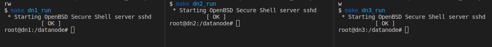
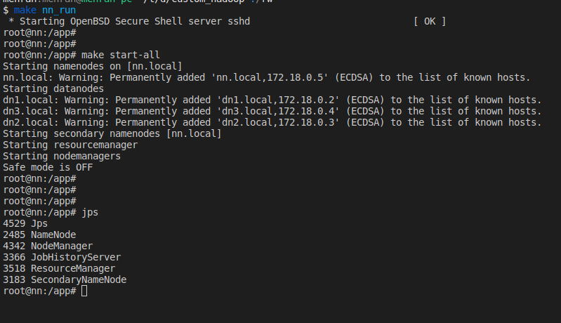

# Hadoop Cluster Using Docker
This section contain a 4 docker images which running with one namenode and 3 datanodes. The datanodes can be extended easily. Here is some features of this custom docker: 

NOTE: `HBASE Database` and `Zookeeper` will install too during installation process.  

* useful for learning 
* all details are designed from scratch in separate docker files. In addition all configure files are separated into folders
* all containers can be run with simple `make` command
* all containers are installed from scratch ( from ubuntu container )

 
 

# Per Install Notes:
Following requirements should be installed before start run docker
* docker 
* gnu make (or its windows equivalent) 

 
 

# Install Notes

NOTE: the steps **ARE IN ORDER**

* run `make create_network` to create network. 
    * the created network name will be `hadoop_network`
* run `make nn_build` to create name node. 
    * to delete name node just run `make nn_rm`
* run `make dn_build` to create data node image
    * Although there is only one datanode, all containers will run with this container
    * To delete data node image run `make dn_rm`

 
 

# Running Notes 

Do the following steps : 

run all containers : 

* to run name node container please run : `make nn_run`, this command will lead you to namenode's container terminal. 
* open another shell command (or CMD in windows) and run  `make dn1_run`, this command will lead you to datanode 1 container terminal. 
* open another shell command (or CMD in windows) and run  `make dn2_run`, this command will lead you to datanode 2 container terminal. 
* open another shell command (or CMD in windows) and run  `make dn3_run`, this command will lead you to datanode 3 container terminal. 

* go to the namenode terminal and run: `make start-all`, to test run `jps` in namenode's terminal. you will see that namenode is running. 

# LICENSE
This project is licensed under the GNU GENERAL PUBLIC LICENSE - see the [LICENSE](../LICENSE) file for details
